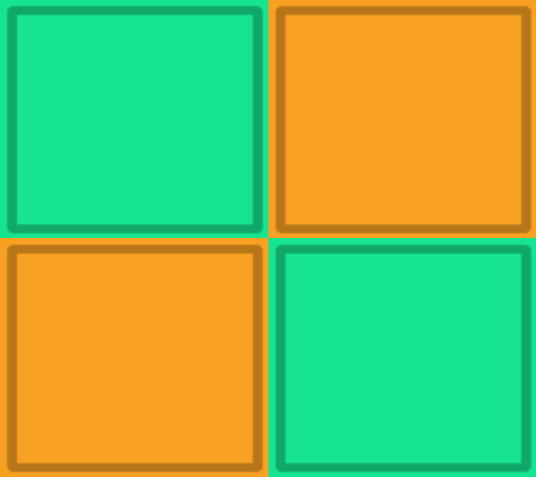

# Tile Memory

Welcome to the Unity Colour Matching Tiles Game! This game challenges players to match coloured tiles as quickly as possible. It comes with various difficulty levels, and even allows users to set up a custom grid.

## Game Modes

### 1. Easy
- Grid Size: 2x3
- Description: Ideal for beginners, this mode offers a simple and easy-to-navigate grid to get started with the game.

### 2. Medium
- Grid Size: 3x4
- Description: A moderately challenging grid size that adds an extra layer of difficulty and excitement to the game.

### 3. Hard
- Grid Size: 4x5
- Description: For those looking for a challenge, this mode offers a larger grid size and tests your tile-matching skills.

### 4. Custom
- Grid Size: Up to 10x10
- Description: Allows users to customize the grid size to their preference, offering a personalized gaming experience.

## How to Play

1. **Start the Game**: Launch the game and choose a difficulty level or customize your grid.
2. **Match the Tiles**: Once the game starts, remember the positions of the coloured tile pairs.
3. **Win the Game**: The goal is to match all tiles from memory in the shortest time possible. Your time is recorded, so try to beat your best score!

## Contributing

We welcome contributions to this project! Please feel free to open an issue or submit a pull request.

## Contact

If you have any questions or suggestions, please feel free to contact me
